# How I Hacked the MonitorsThree

## What is MonitorsThree?
MonitorsThree is a medium-level Linux machine available on the Hack The Box ethical hacking platform.

### Objective
The goal is to obtain the **user flag** and **root flag** by using various penetration testing techniques.

This is a quick visual demonstration of how I successfully hacked the MonitorsThree machine in Hack The Box.

---

## Step 1: Port Scanning

Two interesting open ports were discovered. Additionally, the SSH host key was revealed.

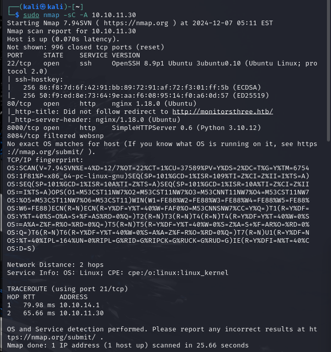

---

## Step 2: Updating `/etc/hosts`

Using my favorite one-liner, I added the relevant information to `/etc/hosts`.

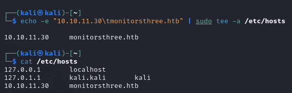

---

## Step 3: Checking the New Host in Browser and Enumerating Subdomains

A website was found at `http://monitorsthree.htb`. It is a simple one-page site with a login feature. Let’s investigate the login functionality.

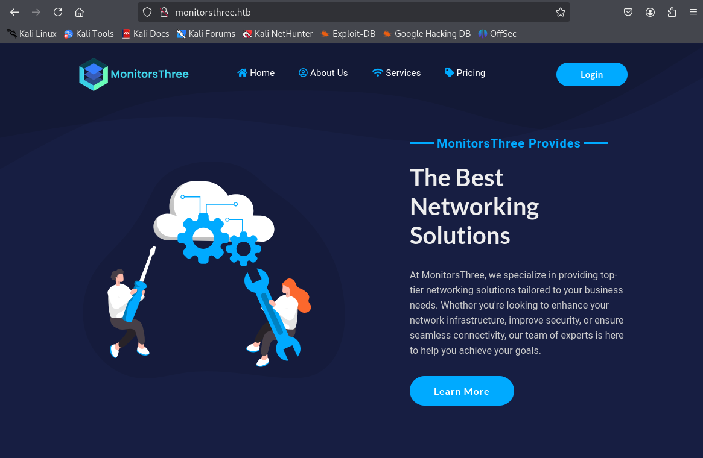

### Subdomain Enumeration
Using `ffuf`, I discovered a subdomain named **cacti**.

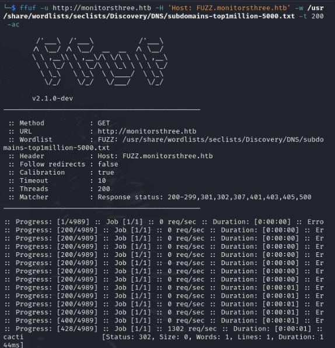

I added this subdomain to `/etc/hosts`:

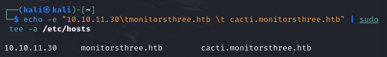

Checking the subdomain in the browser revealed a login page. Default credentials didn’t work.

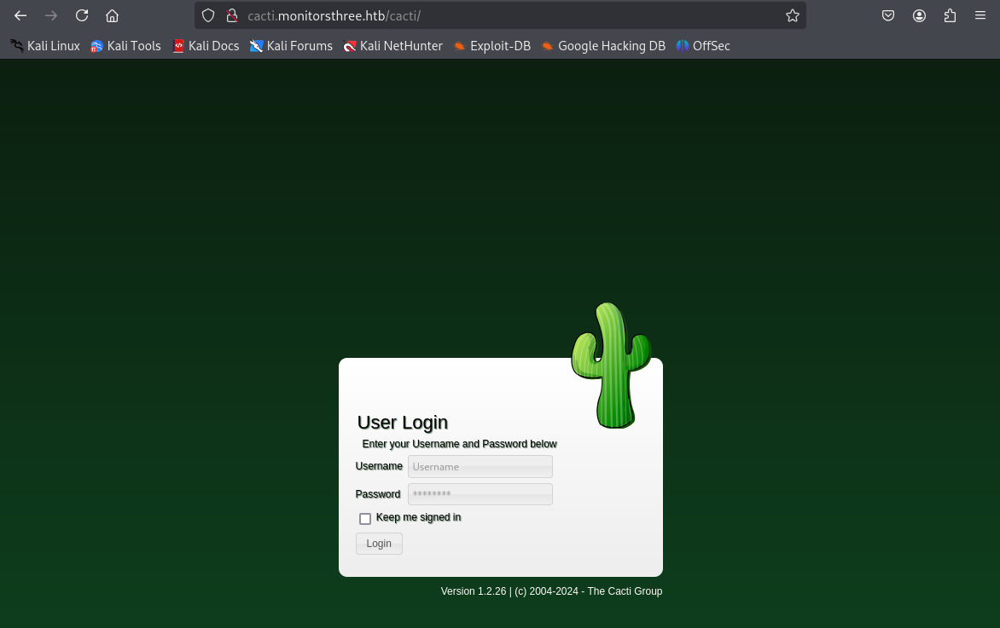

The version number, 1.2.26, caught my attention. A quick search revealed **CVE-2024-25641**, which could allow a reverse shell after logging in. However, I first needed valid credentials.

Returning to the original login page, I noticed an interesting "Forgot Password" feature:

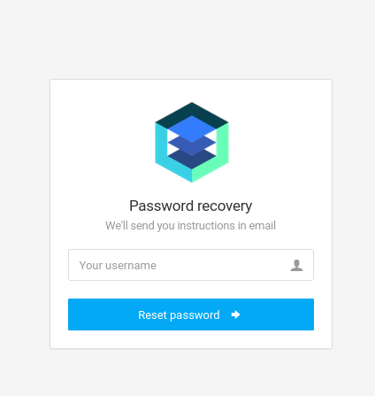

---

## Step 4: Exploiting the "Forgot Password" Page with SQL Injection

I researched and found that the "Forgot Password" page in this version of Cacti is vulnerable to SQL injection. Using **sqlmap**, I confirmed the vulnerability.

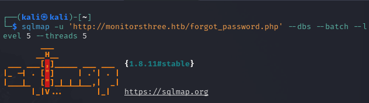

Initially, the attempts were unsuccessful:

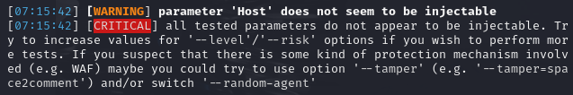
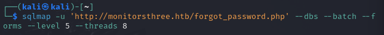

Eventually, I retrieved the username and password hash. I won’t spoil the credentials here, but I used **hashcat** to crack the MD5 hash:

---

## Step 5: Logging In and Exploring

After cracking the credentials, I successfully logged in:

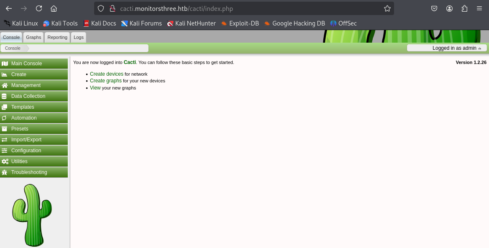

### Exploiting CVE-2024-25641
I revisited CVE-2024-25641 to execute a reverse shell. This involved setting up a listener, cloning the Proof-of-Concept (PoC), modifying it, and executing the exploit:

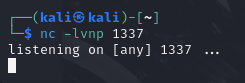

After successfully gaining a reverse shell:

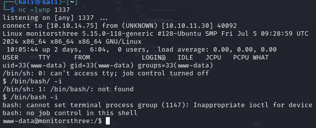

---

## Step 6: Privilege Escalation to User

Exploring the system revealed a user named "marcus" and a database configuration file containing credentials:

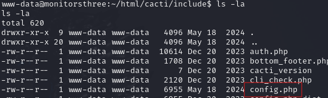

Using these credentials, I accessed the database and extracted password hashes for **marcus** and **admin**. Cracking these hashes (again, not shown to avoid spoilers), I logged in as marcus and retrieved the **user flag**:

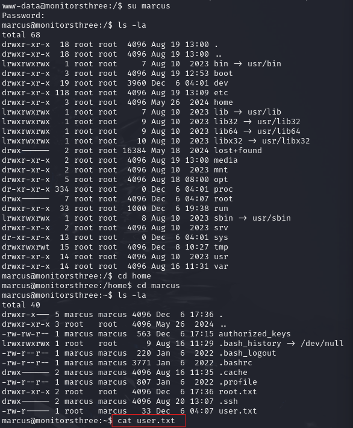

---

## Step 7: Privilege Escalation to Root

With marcus's access, I found an **admin hash** in the database. However, I couldn't locate the admin user. After additional enumeration, I shifted focus to open ports. Port **8200** stood out.

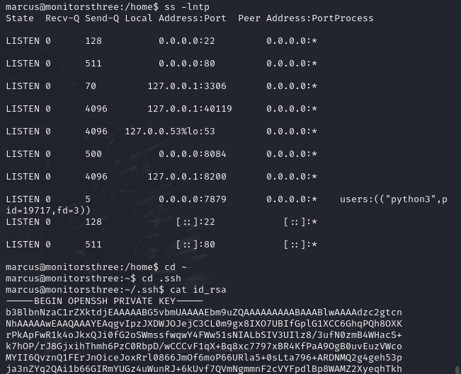

I set up port forwarding successfully:

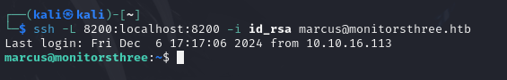

This revealed a web interface, but I lacked credentials:

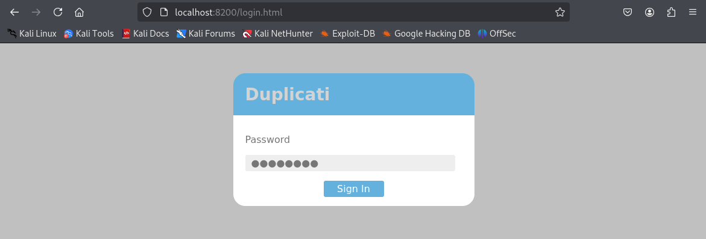

After thorough exploration, I unexpectedly stumbled upon the **root flag** directly:

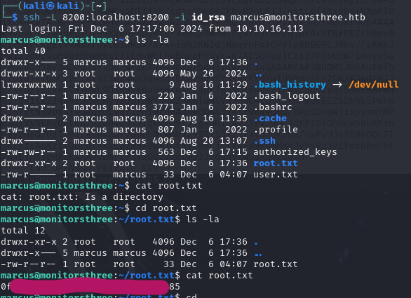

---

## Conclusion

This machine had a surprising and unplanned ending. While I enjoyed applying various hacking techniques, the machine's difficulty felt more straightforward than expected for a medium-level challenge. Nevertheless, it was a fun and educational experience.

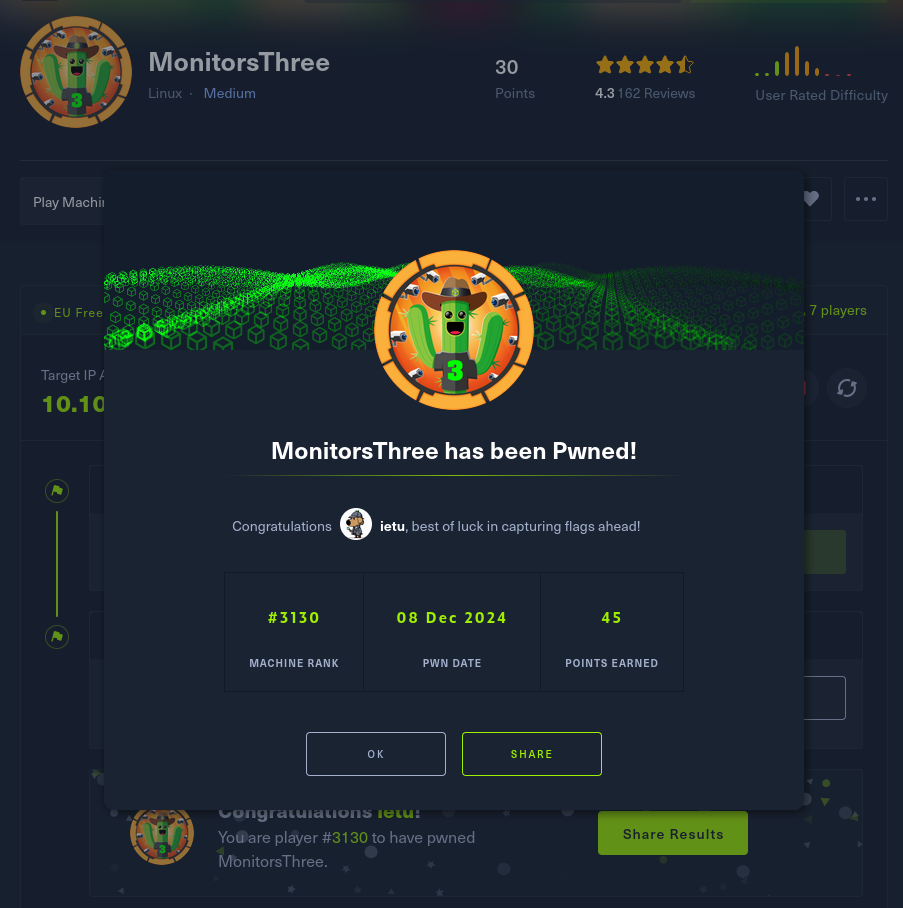
